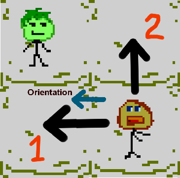

## Overview

This folder includes `movs algorithms`, although the name of the folder is, simply, *movs*.

`movs` means a set of possible action directions, while a `movs algorithm` is an algorithm which figures out what directions to include in that set.

## Basic Example

For example, in case you want the simplest basic orthogonal moving toward the player, like that of a skeleton in the original Necrodancer, you would use the predefined `basic movs algorithm`. Some illustrations would help.

On this example, the arrow shows the direction that the movs algorithm has generated. But wait, isn't there supposed to be *a set* of different directions?

In such a case, there would be 2 directions generated by the movs algorithm, because both get you closer to the player. The first would have the highest priority since the enemy looks in that direction (indicated by the blue arrow), then goes the second, a less desirable, but still acceptable option. Imagine, that the first option were blocked by another enemy. In this case, the second option will be chosen and executed.

## Movs and the General Algo

Movs are, in essence, applicable only to the `GeneralAlgo`, which works with a set of directions. However, if you wish to implement some logic like that of a harpy, you have the following possibilities:

1. Mess around with the event, that is, use the `Special` event where you can define a custom control chain, and in the `movs` you would actually store not the directions for the harpy to move, but the desirable points around the player. Then through that chain you would handle those points. This way you'd be able to use the `GeneralAlgo`, but kind of through a hack. It also lacks the possibility to generate points on the fly, which is good for the harpy kind of logic.

2. Define a new `Algo` and use that instead of the `GeneralAlgo`. Make it follow your custom logic instead, that is, figure out the closest free point to the player in e.g. radius of 3 around the harpy and then hop onto that spot if it is free. If it is not, repeat, until all points have been accounted for. You don't have to generate a whole list of points this way. You can just walk around the player in some e.g. circular fashion and get next points this way. 

However, if your entity follows a more common pattern, that is, moves in some direction and/or does something, it is recommended to use the `GeneralAlgo` while providing a custom chain to your `Special` action.

For example, consider bombers. For bombers, your `Special` chain will have the following handlers.
1. if in the targeted cell there is a player, explode ->
2. else try moving to that spot

So nothing too crazy here.

Bear in mind, though, that the `GeneralAlgo` supports just one action at a time!