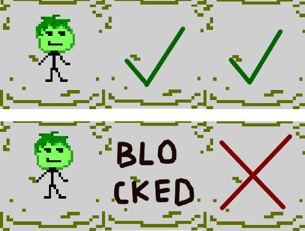

## Overview

Weapons offer a way of incorporating patterns into normal attacks. 

They achieve any behavior you want using these 2 (3) things:
1. The **pattern**. Specifies kind of the form of the attack;
2. The **check function** and the **(algorithm) chain**. Describes the algorithm of filtering the targets acquired by means of pattern;


## Pattern

`Pattern` contains relative to the weapon holder coordinates and some other attributes. All of these are wrapped in `Piece` objects. The `Piece` attributes are as follows:

| Attribute | Type | Description |
| --------- | ---- | --------- |
| `pos`     | Vec  | Coordinate relative to the attacker |
| `dir`     | Vec  | Knockback direction |
| `reach`   | Bool or an array of indices | Whether to keep the target only if all previous attacks (if given a table of indices, check those indices) were not blocked by e.g. a wall |

The default orientation, against which the pieces are rotated, is *Vec(1, 0)* (straight to the right), so build all your patterns as though your character looks to the right.

For example, consider the spear attack pattern:
```lua
local pattern = Pattern()
pattern:add( Vec(1, 0), Vec(1, 0), false ) -- { pos = (1, 0), dir = (1, 0), reach = false }
pattern:add( Vec(2, 0), Vec(1, 0), true  ) -- { pos = (2, 0), dir = (1, 0), reach = true  }
```

Which represents the following attack pattern. Note that in the case when the first spot is blocked, the second is not targeted, since reach of the second piece is true.



For a more specific behavior of `reach`, that is, checking attacks at specific indices, just provide a list of indices instead of true in the pattern definition, like so:

```lua
local pattern = Pattern()
pattern:add( Vec(1, 0),  Vec(1, 0),  false )
pattern:add( Vec(1, 1),  Vec(0, 1),  false )
pattern:add( Vec(1, -1), Vec(0, -1), false )
pattern:add( Vec(1, 2),  Vec(0, 1),  { 2 } )
pattern:add( Vec(1, -2), Vec(0, -1), { 3 } )
```

Which happens to be the pattern of a whip in the original Necrodancer.

In case you are using the `general weapon (algorithm) chain`, the pieces of your pattern will be tested in order and only the first match will make it into the targets list. 


## The chains

The ability to define custom weapon chains gives you precise control over the algorithm of your specific weapon. For most weapons, though, the general chain and the hit all chain will cover the needs.

These custom chains should be set as `Weapon.chain` for the algorithm chain and `Weapon.check` for the check function.


### The general (algorithm) chain

The steps that the general (algorithm) chain follows are the following:
1. Filter out targets without entities;
1. Check if hitting only those entities that are attackable only when you are next to them (e.g. crates) without being next to any (return an empty list in this case);
3. Check unreachableness (eliminate unreachable ones), which is what `Piece.reach` is responsible for;
2. Filter out the targets with `Attackableness.NO`;
4. Eliminate targets with `Attackableness.IS_CLOSE` that aren't close, that is, prioritize normal enemies over e.g. crates. TODO: Targets with `Attackablesness.SKIP` are not taken into account;
5. Take the first target in the list, unless it has `Attackableness.SKIP`. In this case, take the first available after it.

The general check function stops propagation if `event.propagate` is false or if the list of targets is empty.  


### Hitting all targets

There is another standart chain you can use, called `hitAll`. Its steps are as follows: 
1. Filter out targets without entities;
2. Check if hitting only those entities that are attackable only when you are next to them (e.g. crates) without being next to any (return nothing in this case);
3. Filter the list, leaving only Attackable entities.

Be careful as this algorithm ignores `reach` in the pattern. 

> Now I'm actually realizing that this is not how it should work. For example, the hammer from the original game does not do the attack if there is an unattackable block in front of the character, while in my code as it is it would.

It also provides a check function, which is actually just `Chain.checkPropagate`.

 
## `Weapon:getTargets(actor, action)`

This function returns the list of targets for the current actor and action. Targets are objects of the form:

| Attribute | Type    | Description |
| --------- | ----    | --------- |
| `entity`  | Entity  | The entity targeted by the attack |
| `piece`   | Piece   | The rotated piece object from the pattern |
| `index`   | Number  | Which step in the pattern this piece belongs |
| `attackableness` | Attackableness: NO, YES, IF_CLOSE, SKIP | returned by `Entity:getAttackableness(attacker, action)` on the targeted entity |

In case no targets have been found, it returns an empty list.